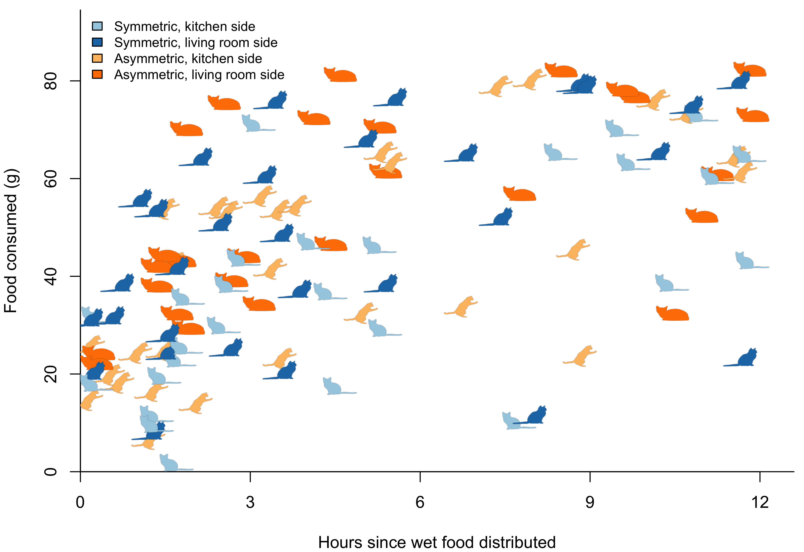

# Kibble Analytics

Code for my kibble analytics study. For more details on what led to this insanity, read my blog. 

## Scripts

**bowl\_bias\_test.R** 
Test for signficant difference in consumption between bowls.

**consumption_barplot.R**  
Barplot of wet food and kibble consumption by date

**download_data.R**  
Download data from Google Drive.. probably not useful for anyone other than me

**isotonic_regression.R** 
Isotonic regression on a CatterPlot

